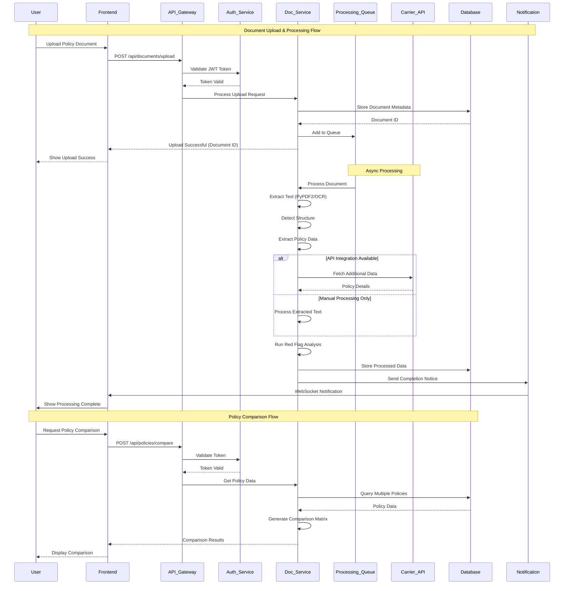

# API Integration Flow

This sequence diagram shows the detailed API interactions for document upload, processing, and policy comparison workflows.



## API Flow Details

### Authentication Flow
**Purpose**: Secure all API endpoints with JWT-based authentication

#### Token Validation Process
1. **Frontend Request**: Include JWT token in Authorization header
2. **Gateway Validation**: API Gateway extracts and validates token
3. **Auth Service Check**: Verify token signature and expiration
4. **User Context**: Extract user ID and permissions from token
5. **Request Forwarding**: Pass validated request to appropriate service

#### Security Measures
- **Token Expiration**: 15-minute access tokens with refresh capability
- **Rate Limiting**: Per-user and per-endpoint rate limits
- **Request Validation**: Input sanitization and schema validation
- **Audit Logging**: All requests logged with user context

### Document Upload Flow
**Purpose**: Handle secure document upload with immediate feedback

#### Upload Process Steps
1. **File Validation**: Check file type, size, and basic structure
2. **Virus Scanning**: Security scan before processing
3. **Metadata Storage**: Store document information in database
4. **Queue Addition**: Add to async processing queue
5. **Immediate Response**: Return document ID and estimated processing time

#### Error Handling
- **Invalid File**: Return specific error with supported formats
- **Size Limit**: Provide guidance on file size restrictions
- **Security Threat**: Alert security team and block upload
- **Storage Error**: Retry with exponential backoff

### Async Processing Flow
**Purpose**: Handle document processing without blocking user interface

#### Processing Pipeline
1. **Queue Management**: FIFO queue with priority levels
2. **Text Extraction**: PyPDF2 for digital, OCR for scanned documents
3. **Structure Detection**: Identify policy sections and components
4. **Data Extraction**: Extract structured data using patterns
5. **API Integration**: Fetch additional data from carrier APIs
6. **Red Flag Analysis**: Apply rules engine for issue detection
7. **Quality Assurance**: Validate extracted data and confidence scores

#### Progress Tracking
- **Status Updates**: Real-time processing status via WebSocket
- **Progress Percentage**: Granular progress tracking (0-100%)
- **Error Reporting**: Detailed error messages for failed processing
- **Retry Logic**: Automatic retry for transient failures

### Carrier API Integration
**Purpose**: Enhance document data with live carrier information

#### Integration Patterns
- **Authentication**: OAuth 2.0 or API key-based authentication
- **Rate Limiting**: Respect carrier API rate limits
- **Data Mapping**: Transform carrier data to internal schema
- **Fallback Logic**: Continue processing if API unavailable

#### Error Handling
- **API Unavailable**: Continue with document-only processing
- **Rate Limit Hit**: Queue requests for later processing
- **Authentication Failure**: Alert admin and disable integration
- **Data Mismatch**: Log discrepancies for manual review

### Real-time Notifications
**Purpose**: Keep users informed of processing status and completion

#### Notification Types
- **Processing Started**: Confirm document processing has begun
- **Progress Updates**: Periodic progress percentage updates
- **Processing Complete**: Notify when analysis is ready
- **Error Alerts**: Inform users of processing failures
- **Red Flag Alerts**: Highlight critical issues found

#### Delivery Mechanisms
- **WebSocket**: Real-time browser notifications
- **Email**: Important status updates and summaries
- **In-App**: Notification center within application
- **Push Notifications**: Mobile app notifications (future)

### Policy Comparison Flow
**Purpose**: Enable side-by-side policy analysis and comparison

#### Comparison Process
1. **Policy Selection**: User selects multiple policies for comparison
2. **Data Retrieval**: Fetch complete policy data from database
3. **Normalization**: Standardize data formats for comparison
4. **Matrix Generation**: Create comparison matrix with key differences
5. **Recommendation Engine**: Generate insights and recommendations
6. **Export Options**: Provide multiple export formats

#### Comparison Features
- **Side-by-Side View**: Visual comparison with highlighting
- **Difference Detection**: Automatic identification of key differences
- **Cost Analysis**: Financial comparison with projections
- **Red Flag Comparison**: Compare identified issues across policies

## API Endpoint Specifications

### Core Endpoints

#### Authentication
```
POST /api/auth/login
POST /api/auth/register
POST /api/auth/refresh
DELETE /api/auth/logout
```

#### Document Management
```
POST /api/documents/upload
GET /api/documents/{id}/status
GET /api/documents/{id}
DELETE /api/documents/{id}
```

#### Policy Management
```
GET /api/policies
GET /api/policies/{id}
POST /api/policies/compare
GET /api/policies/{id}/red-flags
```

#### User Management
```
GET /api/users/profile
PUT /api/users/profile
GET /api/users/preferences
PUT /api/users/preferences
```

### Response Formats

#### Success Response
```json
{
  "success": true,
  "data": { ... },
  "message": "Operation completed successfully",
  "timestamp": "2024-01-01T12:00:00Z"
}
```

#### Error Response
```json
{
  "success": false,
  "error": {
    "code": "VALIDATION_ERROR",
    "message": "Invalid file format",
    "details": { ... }
  },
  "timestamp": "2024-01-01T12:00:00Z"
}
```

#### Processing Status Response
```json
{
  "document_id": "uuid",
  "status": "processing",
  "progress": 65,
  "current_step": "red_flag_analysis",
  "estimated_completion": "2024-01-01T12:05:00Z",
  "steps": [
    {
      "name": "text_extraction",
      "status": "completed",
      "completed_at": "2024-01-01T12:01:00Z"
    },
    {
      "name": "structure_detection",
      "status": "completed",
      "completed_at": "2024-01-01T12:02:00Z"
    },
    {
      "name": "red_flag_analysis",
      "status": "in_progress",
      "started_at": "2024-01-01T12:03:00Z"
    }
  ]
}
```

## Performance Considerations

### Response Time Targets
- **Authentication**: < 200ms
- **File Upload**: < 5 seconds (depends on file size)
- **Status Check**: < 100ms
- **Policy Retrieval**: < 500ms
- **Comparison Generation**: < 2 seconds

### Scalability Measures
- **Connection Pooling**: Database connection management
- **Caching**: Redis caching for frequently accessed data
- **Load Balancing**: Distribute requests across multiple instances
- **Queue Management**: Horizontal scaling of processing workers

### Monitoring and Alerting
- **Response Time Monitoring**: Track API performance metrics
- **Error Rate Tracking**: Monitor and alert on high error rates
- **Queue Depth Monitoring**: Alert on processing queue backups
- **Resource Utilization**: Monitor CPU, memory, and storage usage
