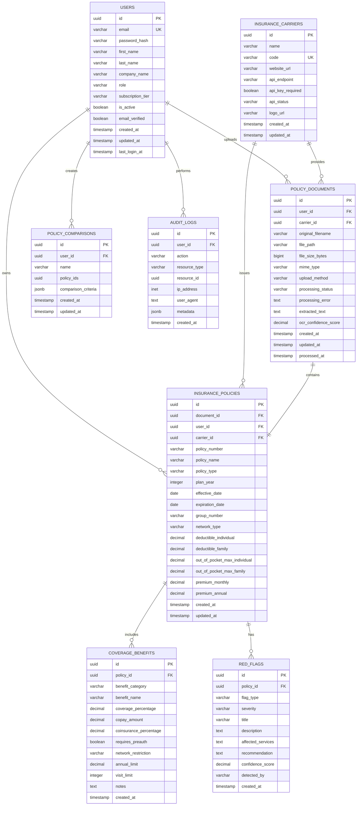

# Database Entity Relationship Diagram

This diagram shows the complete database schema with all tables, relationships, and key constraints.



## Table Descriptions

### USERS
**Purpose**: Store user account information and authentication data
- **Primary Key**: `id` (UUID)
- **Unique Constraints**: `email`
- **Key Features**: Role-based access, subscription tiers, email verification
- **Relationships**: One-to-many with documents, policies, comparisons, audit logs

### INSURANCE_CARRIERS
**Purpose**: Manage insurance carrier information and API configurations
- **Primary Key**: `id` (UUID)
- **Unique Constraints**: `code` (carrier identifier)
- **Key Features**: API endpoint configuration, status tracking
- **Relationships**: One-to-many with documents and policies

### POLICY_DOCUMENTS
**Purpose**: Store uploaded document metadata and processing status
- **Primary Key**: `id` (UUID)
- **Foreign Keys**: `user_id`, `carrier_id`
- **Key Features**: File metadata, processing status, extraction results
- **Relationships**: Belongs to user and carrier, one-to-one with policy

### INSURANCE_POLICIES
**Purpose**: Store structured policy data extracted from documents
- **Primary Key**: `id` (UUID)
- **Foreign Keys**: `document_id`, `user_id`, `carrier_id`
- **Key Features**: Policy details, financial information, dates
- **Relationships**: Belongs to document/user/carrier, one-to-many with benefits/flags

### COVERAGE_BENEFITS
**Purpose**: Store detailed benefit information for each policy
- **Primary Key**: `id` (UUID)
- **Foreign Keys**: `policy_id`
- **Key Features**: Coverage details, costs, limitations, restrictions
- **Relationships**: Belongs to policy

### RED_FLAGS
**Purpose**: Store detected issues and warnings for policies
- **Primary Key**: `id` (UUID)
- **Foreign Keys**: `policy_id`
- **Key Features**: Issue classification, severity levels, recommendations
- **Relationships**: Belongs to policy

### POLICY_COMPARISONS
**Purpose**: Store user-created policy comparisons
- **Primary Key**: `id` (UUID)
- **Foreign Keys**: `user_id`
- **Key Features**: Flexible comparison criteria (JSONB), policy arrays
- **Relationships**: Belongs to user

### AUDIT_LOGS
**Purpose**: Track all user actions for security and compliance
- **Primary Key**: `id` (UUID)
- **Foreign Keys**: `user_id`
- **Key Features**: Action tracking, IP logging, metadata storage
- **Relationships**: Belongs to user

## Key Design Decisions

### UUID Primary Keys
- **Benefit**: Globally unique identifiers, better for distributed systems
- **Security**: Prevents ID enumeration attacks
- **Scalability**: No auto-increment bottlenecks

### JSONB Fields
- **Flexibility**: Store variable comparison criteria and metadata
- **Performance**: Indexed JSON queries in PostgreSQL
- **Evolution**: Schema can evolve without migrations

### Timestamp Tracking
- **Audit Trail**: Created/updated timestamps on all entities
- **Compliance**: Required for HIPAA and security auditing
- **Analytics**: Support for time-based analysis

### Soft Relationships
- **Carrier ID**: Optional foreign key allows manual document uploads
- **Flexible Design**: Supports both API and manual workflows
- **Data Integrity**: Maintains relationships while allowing flexibility

## Indexes for Performance

### Primary Indexes
```sql
-- User lookups
CREATE INDEX idx_users_email ON users(email);
CREATE INDEX idx_users_company ON users(company_name);

-- Document processing
CREATE INDEX idx_policy_documents_user_id ON policy_documents(user_id);
CREATE INDEX idx_policy_documents_status ON policy_documents(processing_status);
CREATE INDEX idx_policy_documents_created_at ON policy_documents(created_at);

-- Policy searches
CREATE INDEX idx_insurance_policies_user_id ON insurance_policies(user_id);
CREATE INDEX idx_insurance_policies_carrier_id ON insurance_policies(carrier_id);
CREATE INDEX idx_insurance_policies_policy_type ON insurance_policies(policy_type);
CREATE INDEX idx_insurance_policies_effective_date ON insurance_policies(effective_date);

-- Benefits and red flags
CREATE INDEX idx_coverage_benefits_policy_id ON coverage_benefits(policy_id);
CREATE INDEX idx_coverage_benefits_category ON coverage_benefits(benefit_category);
CREATE INDEX idx_red_flags_policy_id ON red_flags(policy_id);
CREATE INDEX idx_red_flags_severity ON red_flags(severity);

-- Audit and monitoring
CREATE INDEX idx_audit_logs_user_id ON audit_logs(user_id);
CREATE INDEX idx_audit_logs_created_at ON audit_logs(created_at);
CREATE INDEX idx_audit_logs_action ON audit_logs(action);
```
