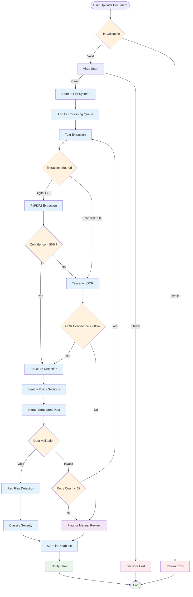

# Document Processing Workflow

This diagram shows the complete document processing pipeline from upload to analysis completion.

## Processing Steps

### 1. File Validation
- **File Type Check**: Ensure uploaded file is PDF, DOC, or TXT
- **Size Validation**: Verify file size is under 50MB limit
- **Structure Check**: Validate PDF integrity and accessibility
- **Security Scan**: Check for malware and suspicious content

### 2. Text Extraction
- **Primary Method**: PyPDF2 for digital PDFs with selectable text
- **Fallback Method**: Tesseract OCR for scanned documents or low-quality PDFs
- **Confidence Scoring**: Calculate extraction quality score
- **Quality Threshold**: 80% confidence for PyPDF2, 60% for OCR

### 3. Structure Detection
- **Section Identification**: Locate policy header, benefits, exclusions, costs
- **Pattern Recognition**: Use regex and NLP to identify document structure
- **Content Classification**: Categorize different types of policy information
- **Validation**: Ensure all required sections are present

### 4. Data Extraction
- **Structured Data**: Extract policy numbers, dates, amounts, percentages
- **Benefit Details**: Parse coverage information and limitations
- **Cost Information**: Extract deductibles, premiums, out-of-pocket maximums
- **Provider Networks**: Identify network types and restrictions

### 5. Red Flag Detection
- **Rule-Based Analysis**: Apply predefined rules for common issues
- **Pattern Detection**: Identify unusual coverage limitations
- **Cost Analysis**: Flag high deductibles or unusual cost structures
- **Severity Classification**: Assign severity levels (Low, Medium, High, Critical)

### 6. Quality Assurance
- **Data Validation**: Verify extracted data makes sense
- **Completeness Check**: Ensure all required fields are populated
- **Consistency Validation**: Check for internal contradictions
- **Confidence Scoring**: Calculate overall processing confidence

## Error Handling

### Validation Errors
- **Invalid File Type**: Return clear error message with supported formats
- **File Too Large**: Provide guidance on file size limits
- **Corrupted File**: Suggest re-uploading or alternative format

### Processing Errors
- **Extraction Failure**: Automatic retry with alternative methods
- **Low Confidence**: Flag for manual review with human oversight
- **Timeout**: Queue for retry during off-peak hours

### Recovery Mechanisms
- **Automatic Retry**: Up to 3 attempts with different extraction methods
- **Manual Review Queue**: Human verification for problematic documents
- **Partial Processing**: Save successfully extracted data even if incomplete
- **User Notification**: Keep users informed of processing status

## Performance Targets

### Processing Speed
- **Digital PDFs**: < 10 seconds average processing time
- **Scanned Documents**: < 30 seconds with OCR processing
- **Large Files**: < 60 seconds for files over 10MB

### Accuracy Targets
- **Text Extraction**: > 95% accuracy for digital PDFs
- **OCR Accuracy**: > 85% accuracy for scanned documents
- **Data Extraction**: > 90% accuracy for structured fields
- **Red Flag Detection**: > 80% accuracy with < 5% false positives
