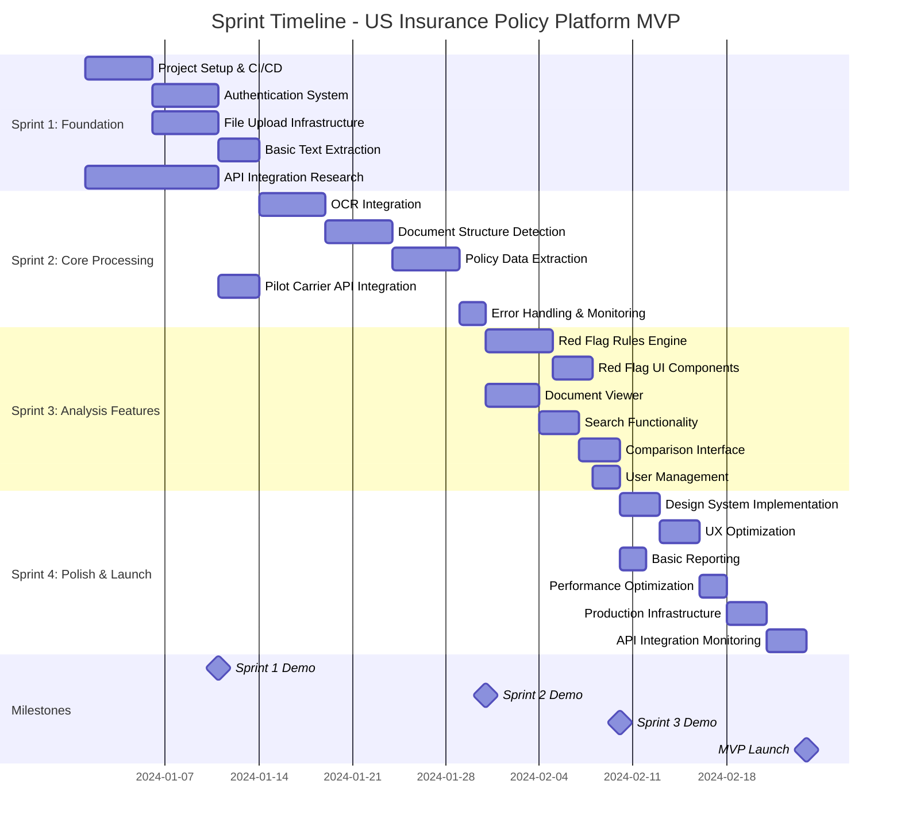

# Sprint Timeline & Dependencies

This Gantt chart shows the 8-week MVP development timeline with task dependencies and milestones.

## Sprint Breakdown

### Sprint 1: Foundation (Weeks 1-2)
**Goal**: Establish core infrastructure and basic document processing capabilities

#### Project Setup & CI/CD (5 days)
- **Dependencies**: None (can start immediately)
- **Deliverables**: 
  - Repository structure and branching strategy
  - Docker development environment
  - CI/CD pipeline with automated testing
  - Code quality tools (linting, formatting)
- **Team**: Full team collaboration
- **Risk**: Low - standard setup procedures

#### Authentication System (5 days)
- **Dependencies**: Project setup completion
- **Deliverables**:
  - User registration and login endpoints
  - JWT token management
  - Protected route middleware
  - Basic user management UI
- **Team**: Backend + Frontend developers
- **Risk**: Low - well-established patterns

#### File Upload Infrastructure (5 days)
- **Dependencies**: Project setup completion
- **Deliverables**:
  - File upload API with validation
  - Cloud storage integration
  - Upload progress tracking
  - Drag-and-drop UI component
- **Team**: Backend + Frontend developers
- **Risk**: Medium - file handling complexity

#### Basic Text Extraction (3 days)
- **Dependencies**: File upload infrastructure
- **Deliverables**:
  - PyPDF2 integration for digital PDFs
  - Text extraction service
  - Basic error handling
  - Extracted text storage
- **Team**: Backend developer
- **Risk**: Medium - PDF parsing challenges

#### API Integration Research (10 days)
- **Dependencies**: None (parallel with development)
- **Deliverables**:
  - Carrier API documentation analysis
  - Authentication requirements mapping
  - Integration feasibility assessment
  - Prototype API client
- **Team**: Backend developer + Product owner
- **Risk**: High - external API dependencies

### Sprint 2: Core Processing (Weeks 3-4)
**Goal**: Advanced document processing and data normalization

#### OCR Integration (5 days)
- **Dependencies**: Basic text extraction completion
- **Deliverables**:
  - Tesseract OCR integration
  - Confidence scoring system
  - Fallback logic implementation
  - OCR quality optimization
- **Team**: Backend developer
- **Risk**: High - OCR accuracy challenges

#### Document Structure Detection (5 days)
- **Dependencies**: OCR integration completion
- **Deliverables**:
  - Policy section identification
  - Structure parsing algorithms
  - Content classification system
  - Validation logic
- **Team**: Backend developer
- **Risk**: High - document format variability

#### Policy Data Extraction (5 days)
- **Dependencies**: Structure detection completion
- **Deliverables**:
  - Field extraction patterns
  - Data validation rules
  - Multi-format support
  - Quality scoring system
- **Team**: Backend developer
- **Risk**: Medium - data accuracy requirements

#### Pilot Carrier API Integration (3 days)
- **Dependencies**: API research completion
- **Deliverables**:
  - Live API integration with one carrier
  - Authentication implementation
  - Data synchronization logic
  - Error handling and retries
- **Team**: Backend developer
- **Risk**: High - external API reliability

#### Error Handling & Monitoring (2 days)
- **Dependencies**: Data extraction completion
- **Deliverables**:
  - Comprehensive error logging
  - Retry mechanisms
  - User notifications
  - Admin monitoring dashboard
- **Team**: Backend developer
- **Risk**: Low - standard monitoring practices

### Sprint 3: Analysis Features (Weeks 5-6)
**Goal**: Core analysis capabilities and user interface

#### Red Flag Rules Engine (5 days)
- **Dependencies**: Error handling completion
- **Deliverables**:
  - Rule definition framework
  - Evaluation engine
  - Severity classification
  - Confidence scoring
- **Team**: Backend developer
- **Risk**: Medium - rule complexity

#### Red Flag UI Components (3 days)
- **Dependencies**: Rules engine completion
- **Deliverables**:
  - Flag display components
  - Severity indicators
  - Filtering and sorting
  - Details modal
- **Team**: Frontend developer
- **Risk**: Low - standard UI components

#### Document Viewer (4 days)
- **Dependencies**: Error handling completion (parallel with rules engine)
- **Deliverables**:
  - PDF viewer component
  - Text highlighting
  - Navigation controls
  - Annotation system
- **Team**: Frontend developer
- **Risk**: Medium - PDF rendering complexity

#### Search Functionality (3 days)
- **Dependencies**: Document viewer completion
- **Deliverables**:
  - Full-text search implementation
  - Search filters
  - Result ranking
  - Search suggestions
- **Team**: Backend + Frontend developers
- **Risk**: Medium - search performance

#### Comparison Interface (3 days)
- **Dependencies**: Search functionality completion
- **Deliverables**:
  - Policy selection interface
  - Comparison table component
  - Side-by-side view
  - Export functionality
- **Team**: Frontend developer
- **Risk**: Low - standard comparison UI

#### User Management (2 days)
- **Dependencies**: Red flag UI completion
- **Deliverables**:
  - Profile management
  - Team features
  - Role management
  - User preferences
- **Team**: Backend + Frontend developers
- **Risk**: Low - standard user management

### Sprint 4: Polish & Launch (Weeks 7-8)
**Goal**: Production readiness and MVP launch

#### Design System Implementation (3 days)
- **Dependencies**: User management completion
- **Deliverables**:
  - Design tokens and components
  - Consistent styling
  - Responsive design
  - Accessibility features
- **Team**: Frontend developer
- **Risk**: Low - design system application

#### UX Optimization (3 days)
- **Dependencies**: Design system completion
- **Deliverables**:
  - Loading states and skeletons
  - Error boundaries
  - Onboarding flow
  - Contextual help
- **Team**: Frontend developer
- **Risk**: Low - UX improvements

#### Basic Reporting (2 days)
- **Dependencies**: Comparison interface completion
- **Deliverables**:
  - Summary reports
  - Analytics dashboard
  - Export functionality
  - Report scheduling
- **Team**: Backend + Frontend developers
- **Risk**: Low - standard reporting

#### Performance Optimization (2 days)
- **Dependencies**: UX optimization completion
- **Deliverables**:
  - Database query optimization
  - Caching implementation
  - Bundle size optimization
  - Performance monitoring
- **Team**: Full team
- **Risk**: Medium - performance tuning

#### Production Infrastructure (3 days)
- **Dependencies**: Performance optimization completion
- **Deliverables**:
  - Production environment setup
  - Monitoring and alerting
  - Backup strategies
  - SSL certificates
- **Team**: Backend developer + DevOps
- **Risk**: Medium - production deployment

#### API Integration Monitoring (3 days)
- **Dependencies**: Production infrastructure completion
- **Deliverables**:
  - API health monitoring
  - Fallback mechanisms
  - Status dashboard
  - Automated alerts
- **Team**: Backend developer
- **Risk**: Low - monitoring implementation

## Critical Path Analysis

### Primary Critical Path
1. Project Setup → Authentication → File Upload → Text Extraction
2. Text Extraction → OCR → Structure Detection → Data Extraction
3. Data Extraction → Error Handling → Red Flag Engine → Red Flag UI
4. Red Flag UI → User Management → Design System → UX Optimization
5. UX Optimization → Performance → Production → Launch

### Parallel Work Streams
- **API Research** (Sprint 1) runs parallel to core development
- **Document Viewer** (Sprint 3) can develop parallel to Red Flag engine
- **Basic Reporting** (Sprint 4) can develop parallel to design system

### Risk Mitigation
- **OCR Integration**: Start research early, have manual review fallback
- **API Integration**: Develop with mock data, real API integration as stretch goal
- **Performance**: Monitor throughout development, not just at the end
- **Production**: Set up staging environment early for testing

## Resource Allocation

### Team Composition
- **Backend Developer**: Focus on processing pipeline and API integration
- **Frontend Developer**: Focus on UI components and user experience
- **Full-Stack Developer**: Support both areas, handle integration tasks

### Skill Requirements
- **Backend**: Python, FastAPI, PostgreSQL, PDF processing, OCR
- **Frontend**: React, TypeScript, Next.js, responsive design
- **DevOps**: Docker, CI/CD, cloud deployment, monitoring

### Success Metrics
- **Velocity**: 20-25 story points per sprint
- **Quality**: >80% test coverage, <5% bug rate
- **Performance**: Meet all defined performance targets
- **Delivery**: On-time delivery of all sprint goals
