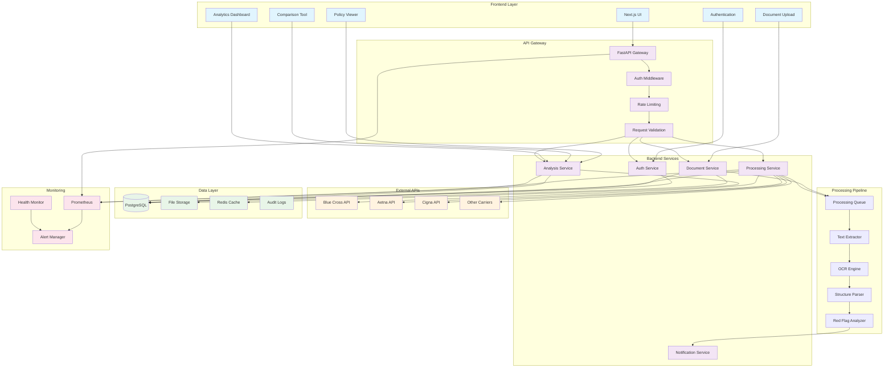

# System Architecture Overview

This diagram shows the complete system architecture for the US Insurance Policy Platform, including all layers and their interactions.

## Architecture Components

### Frontend Layer
- **Next.js UI**: Main user interface built with React and TypeScript
- **Authentication**: User login/logout and session management
- **Document Upload**: File upload interface with drag-and-drop
- **Policy Viewer**: Document and policy data visualization
- **Comparison Tool**: Side-by-side policy comparison interface
- **Analytics Dashboard**: Metrics and reporting interface

### API Gateway
- **FastAPI Gateway**: Main API entry point with automatic documentation
- **Auth Middleware**: JWT token validation and user context
- **Rate Limiting**: API usage throttling and abuse prevention
- **Request Validation**: Input validation and sanitization

### Backend Services
- **Auth Service**: User authentication and authorization
- **Document Service**: File upload, storage, and metadata management
- **Processing Service**: Document processing orchestration
- **Analysis Service**: Policy analysis and comparison logic
- **Notification Service**: Real-time user notifications

### Processing Pipeline
- **Processing Queue**: Async job queue for document processing
- **Text Extractor**: PDF text extraction using PyPDF2
- **OCR Engine**: Tesseract OCR for scanned documents
- **Structure Parser**: Policy structure detection and parsing
- **Red Flag Analyzer**: Automated red flag detection

### External APIs
- **Insurance Carrier APIs**: Direct integration with carrier systems
- **Blue Cross API**: Blue Cross Blue Shield integration
- **Aetna API**: Aetna carrier integration
- **Cigna API**: Cigna carrier integration
- **Other Carriers**: Additional carrier integrations

### Data Layer
- **PostgreSQL**: Primary database for structured data
- **File Storage**: Document and file storage (Supabase/S3)
- **Redis Cache**: Performance caching layer
- **Audit Logs**: Security and compliance logging

### Monitoring
- **Prometheus**: Metrics collection and storage
- **Alert Manager**: Alert routing and notification
- **Health Monitor**: System health and uptime monitoring
