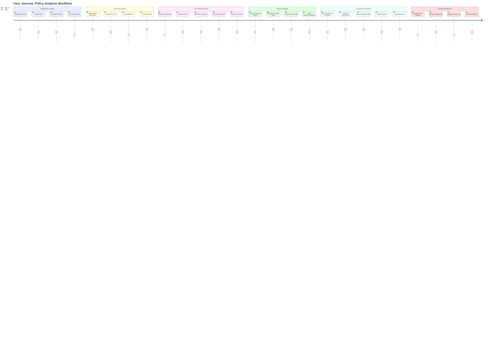

# User Journey & Workflow

This diagram shows the complete user experience from registration through policy analysis and decision making.

## Journey Phases

### Phase 1: Registration & Setup
**Goal**: Get users onboarded and ready to use the platform

#### Register Account (Satisfaction: 5/5)
- **Action**: User creates new account with email and password
- **Experience**: Simple, fast registration process
- **Success Factors**: Clear value proposition, minimal required fields
- **Pain Points**: Email verification delay

#### Verify Email (Satisfaction: 4/5)
- **Action**: User clicks verification link in email
- **Experience**: Standard email verification flow
- **Success Factors**: Clear instructions, quick verification
- **Pain Points**: Email may go to spam folder

#### Complete Profile (Satisfaction: 4/5)
- **Action**: User adds company information and role
- **Experience**: Optional profile enhancement
- **Success Factors**: Clear benefits of completing profile
- **Pain Points**: Additional steps after registration

#### Set Preferences (Satisfaction: 3/5)
- **Action**: User configures notification and analysis preferences
- **Experience**: Optional customization step
- **Success Factors**: Smart defaults, clear explanations
- **Pain Points**: Too many options can be overwhelming

### Phase 2: Document Upload
**Goal**: Enable users to easily upload policy documents for analysis

#### Select Policy Document (Satisfaction: 5/5)
- **Action**: User chooses policy document from their files
- **Experience**: Intuitive file selection
- **Success Factors**: Clear file type guidance, drag-and-drop support
- **Pain Points**: Large file sizes, unsupported formats

#### Upload PDF File (Satisfaction: 4/5)
- **Action**: User uploads document to the platform
- **Experience**: Visual upload progress, clear feedback
- **Success Factors**: Fast upload, progress indicators
- **Pain Points**: Slow upload for large files, connection issues

#### Add Metadata (Satisfaction: 3/5)
- **Action**: User provides additional policy information
- **Experience**: Optional metadata entry
- **Success Factors**: Auto-detection of some fields, smart suggestions
- **Pain Points**: Manual data entry, unclear field requirements

#### Confirm Upload (Satisfaction: 5/5)
- **Action**: User confirms upload and starts processing
- **Experience**: Clear confirmation and next steps
- **Success Factors**: Immediate feedback, processing time estimates
- **Pain Points**: Uncertainty about processing time

### Phase 3: Processing & Analysis
**Goal**: Automatically extract and analyze policy information

#### Document Validation (Satisfaction: 3/5)
- **Action**: System validates file format and content
- **Experience**: Behind-the-scenes validation
- **Success Factors**: Fast validation, clear error messages
- **Pain Points**: Rejection of valid but unusual formats

#### Text Extraction (Satisfaction: 4/5)
- **Action**: System extracts text from PDF document
- **Experience**: Automated processing with progress updates
- **Success Factors**: High accuracy, fallback to OCR
- **Pain Points**: Poor quality scanned documents

#### Structure Detection (Satisfaction: 4/5)
- **Action**: System identifies policy sections and structure
- **Experience**: Intelligent document parsing
- **Success Factors**: Recognition of various policy formats
- **Pain Points**: Non-standard policy layouts

#### Red Flag Analysis (Satisfaction: 5/5)
- **Action**: System analyzes policy for potential issues
- **Experience**: Automated risk assessment
- **Success Factors**: Comprehensive rule set, clear explanations
- **Pain Points**: False positives, missed edge cases

#### Quality Assurance (Satisfaction: 4/5)
- **Action**: System validates extracted data quality
- **Experience**: Confidence scoring and validation
- **Success Factors**: Transparency in confidence levels
- **Pain Points**: Conservative confidence thresholds

### Phase 4: Review & Insights
**Goal**: Present analysis results in an actionable format

#### View Processing Status (Satisfaction: 4/5)
- **Action**: User checks processing progress and completion
- **Experience**: Real-time status updates
- **Success Factors**: Clear progress indicators, time estimates
- **Pain Points**: Long processing times for complex documents

#### Review Extracted Data (Satisfaction: 5/5)
- **Action**: User examines extracted policy information
- **Experience**: Clean, organized data presentation
- **Success Factors**: Accurate extraction, intuitive layout
- **Pain Points**: Missing or incorrect data

#### Examine Red Flags (Satisfaction: 5/5)
- **Action**: User reviews identified policy issues
- **Experience**: Clear issue highlighting with explanations
- **Success Factors**: Actionable insights, severity classification
- **Pain Points**: Information overload, unclear priorities

#### Read Recommendations (Satisfaction: 4/5)
- **Action**: User reviews system recommendations
- **Experience**: Contextual advice and suggestions
- **Success Factors**: Relevant recommendations, clear actions
- **Pain Points**: Generic advice, limited customization

### Phase 5: Comparison & Decision
**Goal**: Enable informed decision making through policy comparison

#### Select Policies to Compare (Satisfaction: 4/5)
- **Action**: User chooses multiple policies for comparison
- **Experience**: Easy policy selection interface
- **Success Factors**: Clear policy identification, bulk selection
- **Pain Points**: Difficulty finding specific policies

#### Generate Comparison (Satisfaction: 5/5)
- **Action**: System creates side-by-side comparison
- **Experience**: Automated comparison generation
- **Success Factors**: Comprehensive comparison, fast generation
- **Pain Points**: Complex policies may be hard to compare

#### Review Side-by-Side (Satisfaction: 5/5)
- **Action**: User analyzes policy differences and similarities
- **Experience**: Clear visual comparison with highlighting
- **Success Factors**: Easy-to-read format, key differences highlighted
- **Pain Points**: Information density, mobile viewing challenges

#### Export Results (Satisfaction: 4/5)
- **Action**: User downloads comparison report
- **Experience**: Multiple export formats available
- **Success Factors**: Professional formatting, comprehensive data
- **Pain Points**: Large file sizes, limited customization

#### Make Decision (Satisfaction: 5/5)
- **Action**: User makes informed policy choice
- **Experience**: Confident decision based on analysis
- **Success Factors**: Clear insights, actionable information
- **Pain Points**: Complex trade-offs, external factors

### Phase 6: Ongoing Management
**Goal**: Provide continued value through monitoring and updates

#### Monitor Policy Updates (Satisfaction: 3/5)
- **Action**: System tracks policy changes and updates
- **Experience**: Automated monitoring with notifications
- **Success Factors**: Timely updates, relevant changes only
- **Pain Points**: Too many notifications, false alerts

#### Receive Notifications (Satisfaction: 4/5)
- **Action**: User gets alerts about policy changes or issues
- **Experience**: Relevant, timely notifications
- **Success Factors**: Customizable alerts, clear actions
- **Pain Points**: Notification fatigue, unclear urgency

#### Update Preferences (Satisfaction: 3/5)
- **Action**: User modifies notification and analysis settings
- **Experience**: Easy preference management
- **Success Factors**: Granular controls, immediate effect
- **Pain Points**: Too many options, unclear impact

#### Generate Reports (Satisfaction: 4/5)
- **Action**: User creates summary reports for stakeholders
- **Experience**: Automated report generation
- **Success Factors**: Professional formatting, customizable content
- **Pain Points**: Limited templates, complex customization

## Key Success Metrics

### User Satisfaction Targets
- **Overall Journey**: > 4.0/5.0 average satisfaction
- **Critical Steps**: Upload, Analysis, Comparison > 4.5/5.0
- **Task Completion**: > 90% completion rate for core workflows
- **Time to Value**: < 10 minutes from upload to insights

### Experience Optimization
- **Reduce Friction**: Minimize required steps and manual input
- **Increase Transparency**: Clear progress indicators and explanations
- **Improve Accuracy**: Higher confidence in automated analysis
- **Enhance Personalization**: Customized recommendations and insights
