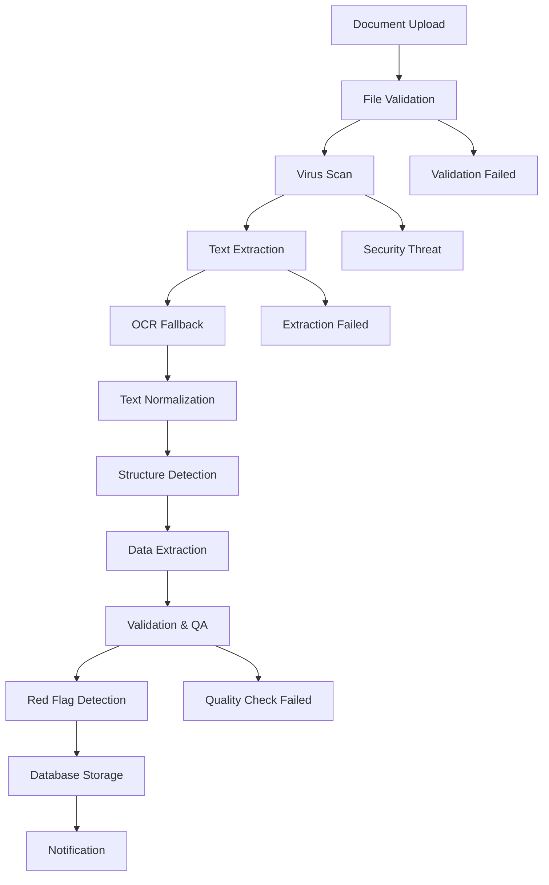

# 🏗️ Technical Specifications - US Insurance Policy Platform

## 📊 Database Schema Design

### Core Tables

#### 1. Users Table
```sql
CREATE TABLE users (
    id UUID PRIMARY KEY DEFAULT gen_random_uuid(),
    email VARCHAR(255) UNIQUE NOT NULL,
    password_hash VARCHAR(255) NOT NULL,
    first_name VARCHAR(100) NOT NULL,
    last_name VARCHAR(100) NOT NULL,
    company_name VARCHAR(255),
    role VARCHAR(50) DEFAULT 'user', -- 'user', 'admin', 'analyst'
    subscription_tier VARCHAR(50) DEFAULT 'free', -- 'free', 'pro', 'enterprise'
    is_active BOOLEAN DEFAULT true,
    email_verified BOOLEAN DEFAULT false,
    created_at TIMESTAMP WITH TIME ZONE DEFAULT NOW(),
    updated_at TIMESTAMP WITH TIME ZONE DEFAULT NOW(),
    last_login_at TIMESTAMP WITH TIME ZONE
);
```

#### 2. Insurance Carriers Table
```sql
CREATE TABLE insurance_carriers (
    id UUID PRIMARY KEY DEFAULT gen_random_uuid(),
    name VARCHAR(255) NOT NULL,
    code VARCHAR(50) UNIQUE NOT NULL, -- 'BCBS', 'AETNA', 'CIGNA'
    website_url VARCHAR(500),
    api_endpoint VARCHAR(500),
    api_key_required BOOLEAN DEFAULT false,
    api_status VARCHAR(50) DEFAULT 'inactive', -- 'active', 'inactive', 'testing'
    logo_url VARCHAR(500),
    created_at TIMESTAMP WITH TIME ZONE DEFAULT NOW(),
    updated_at TIMESTAMP WITH TIME ZONE DEFAULT NOW()
);
```

#### 3. Policy Documents Table
```sql
CREATE TABLE policy_documents (
    id UUID PRIMARY KEY DEFAULT gen_random_uuid(),
    user_id UUID NOT NULL REFERENCES users(id) ON DELETE CASCADE,
    carrier_id UUID REFERENCES insurance_carriers(id),
    original_filename VARCHAR(255) NOT NULL,
    file_path VARCHAR(500) NOT NULL,
    file_size_bytes BIGINT NOT NULL,
    mime_type VARCHAR(100) NOT NULL,
    upload_method VARCHAR(50) NOT NULL, -- 'manual_upload', 'api_fetch', 'email_import'
    processing_status VARCHAR(50) DEFAULT 'pending', -- 'pending', 'processing', 'completed', 'failed'
    processing_error TEXT,
    extracted_text TEXT,
    ocr_confidence_score DECIMAL(5,4), -- 0.0000 to 1.0000
    created_at TIMESTAMP WITH TIME ZONE DEFAULT NOW(),
    updated_at TIMESTAMP WITH TIME ZONE DEFAULT NOW(),
    processed_at TIMESTAMP WITH TIME ZONE
);
```

#### 4. Insurance Policies Table
```sql
CREATE TABLE insurance_policies (
    id UUID PRIMARY KEY DEFAULT gen_random_uuid(),
    document_id UUID NOT NULL REFERENCES policy_documents(id) ON DELETE CASCADE,
    user_id UUID NOT NULL REFERENCES users(id) ON DELETE CASCADE,
    carrier_id UUID REFERENCES insurance_carriers(id),
    policy_number VARCHAR(100),
    policy_name VARCHAR(255) NOT NULL,
    policy_type VARCHAR(100), -- 'health', 'dental', 'vision', 'life'
    plan_year INTEGER,
    effective_date DATE,
    expiration_date DATE,
    group_number VARCHAR(100),
    network_type VARCHAR(50), -- 'HMO', 'PPO', 'EPO', 'POS'
    deductible_individual DECIMAL(10,2),
    deductible_family DECIMAL(10,2),
    out_of_pocket_max_individual DECIMAL(10,2),
    out_of_pocket_max_family DECIMAL(10,2),
    premium_monthly DECIMAL(10,2),
    premium_annual DECIMAL(10,2),
    created_at TIMESTAMP WITH TIME ZONE DEFAULT NOW(),
    updated_at TIMESTAMP WITH TIME ZONE DEFAULT NOW()
);
```

#### 5. Coverage Benefits Table
```sql
CREATE TABLE coverage_benefits (
    id UUID PRIMARY KEY DEFAULT gen_random_uuid(),
    policy_id UUID NOT NULL REFERENCES insurance_policies(id) ON DELETE CASCADE,
    benefit_category VARCHAR(100) NOT NULL, -- 'preventive', 'emergency', 'specialist', 'prescription'
    benefit_name VARCHAR(255) NOT NULL,
    coverage_percentage DECIMAL(5,2), -- 0.00 to 100.00
    copay_amount DECIMAL(10,2),
    coinsurance_percentage DECIMAL(5,2),
    requires_preauth BOOLEAN DEFAULT false,
    network_restriction VARCHAR(50), -- 'in_network_only', 'out_of_network_allowed', 'no_restriction'
    annual_limit DECIMAL(10,2),
    visit_limit INTEGER,
    notes TEXT,
    created_at TIMESTAMP WITH TIME ZONE DEFAULT NOW()
);
```

#### 6. Red Flags Table
```sql
CREATE TABLE red_flags (
    id UUID PRIMARY KEY DEFAULT gen_random_uuid(),
    policy_id UUID NOT NULL REFERENCES insurance_policies(id) ON DELETE CASCADE,
    flag_type VARCHAR(100) NOT NULL, -- 'preauth_required', 'coverage_limitation', 'exclusion', 'high_cost'
    severity VARCHAR(50) NOT NULL, -- 'low', 'medium', 'high', 'critical'
    title VARCHAR(255) NOT NULL,
    description TEXT NOT NULL,
    affected_services TEXT[], -- Array of affected service types
    recommendation TEXT,
    confidence_score DECIMAL(5,4), -- AI confidence in detection
    detected_by VARCHAR(50) DEFAULT 'system', -- 'system', 'manual', 'ai'
    created_at TIMESTAMP WITH TIME ZONE DEFAULT NOW()
);
```

#### 7. Policy Comparisons Table
```sql
CREATE TABLE policy_comparisons (
    id UUID PRIMARY KEY DEFAULT gen_random_uuid(),
    user_id UUID NOT NULL REFERENCES users(id) ON DELETE CASCADE,
    name VARCHAR(255) NOT NULL,
    policy_ids UUID[] NOT NULL, -- Array of policy IDs being compared
    comparison_criteria JSONB, -- Flexible criteria storage
    created_at TIMESTAMP WITH TIME ZONE DEFAULT NOW(),
    updated_at TIMESTAMP WITH TIME ZONE DEFAULT NOW()
);
```

#### 8. Audit Logs Table
```sql
CREATE TABLE audit_logs (
    id UUID PRIMARY KEY DEFAULT gen_random_uuid(),
    user_id UUID REFERENCES users(id),
    action VARCHAR(100) NOT NULL, -- 'upload', 'delete', 'view', 'compare', 'export'
    resource_type VARCHAR(50) NOT NULL, -- 'policy', 'document', 'comparison'
    resource_id UUID,
    ip_address INET,
    user_agent TEXT,
    metadata JSONB,
    created_at TIMESTAMP WITH TIME ZONE DEFAULT NOW()
);
```

### Indexes for Performance
```sql
-- User lookups
CREATE INDEX idx_users_email ON users(email);
CREATE INDEX idx_users_company ON users(company_name);

-- Document processing
CREATE INDEX idx_policy_documents_user_id ON policy_documents(user_id);
CREATE INDEX idx_policy_documents_status ON policy_documents(processing_status);
CREATE INDEX idx_policy_documents_created_at ON policy_documents(created_at);

-- Policy searches
CREATE INDEX idx_insurance_policies_user_id ON insurance_policies(user_id);
CREATE INDEX idx_insurance_policies_carrier_id ON insurance_policies(carrier_id);
CREATE INDEX idx_insurance_policies_policy_type ON insurance_policies(policy_type);
CREATE INDEX idx_insurance_policies_effective_date ON insurance_policies(effective_date);

-- Benefits and red flags
CREATE INDEX idx_coverage_benefits_policy_id ON coverage_benefits(policy_id);
CREATE INDEX idx_coverage_benefits_category ON coverage_benefits(benefit_category);
CREATE INDEX idx_red_flags_policy_id ON red_flags(policy_id);
CREATE INDEX idx_red_flags_severity ON red_flags(severity);

-- Audit and monitoring
CREATE INDEX idx_audit_logs_user_id ON audit_logs(user_id);
CREATE INDEX idx_audit_logs_created_at ON audit_logs(created_at);
CREATE INDEX idx_audit_logs_action ON audit_logs(action);
```

## 🔌 API Endpoint Specifications

### Authentication Endpoints

#### POST /api/auth/register
```json
{
  "request": {
    "email": "string",
    "password": "string",
    "first_name": "string",
    "last_name": "string",
    "company_name": "string?"
  },
  "response": {
    "user": {
      "id": "uuid",
      "email": "string",
      "first_name": "string",
      "last_name": "string",
      "role": "string"
    },
    "access_token": "string",
    "refresh_token": "string"
  }
}
```

#### POST /api/auth/login
```json
{
  "request": {
    "email": "string",
    "password": "string"
  },
  "response": {
    "user": "UserObject",
    "access_token": "string",
    "refresh_token": "string"
  }
}
```

### Document Management Endpoints

#### POST /api/documents/upload
```json
{
  "request": {
    "file": "multipart/form-data",
    "carrier_id": "uuid?",
    "metadata": {
      "policy_name": "string?",
      "policy_number": "string?"
    }
  },
  "response": {
    "document_id": "uuid",
    "status": "pending",
    "estimated_processing_time": "integer (seconds)"
  }
}
```

#### GET /api/documents/{document_id}/status
```json
{
  "response": {
    "document_id": "uuid",
    "status": "string",
    "progress_percentage": "integer",
    "error_message": "string?",
    "processing_steps": [
      {
        "step": "string",
        "status": "string",
        "completed_at": "timestamp?"
      }
    ]
  }
}
```

### Policy Management Endpoints

#### GET /api/policies
```json
{
  "query_params": {
    "page": "integer",
    "limit": "integer",
    "carrier_id": "uuid?",
    "policy_type": "string?",
    "search": "string?"
  },
  "response": {
    "policies": ["PolicyObject"],
    "total_count": "integer",
    "page": "integer",
    "limit": "integer"
  }
}
```

#### GET /api/policies/{policy_id}
```json
{
  "response": {
    "policy": "PolicyObject",
    "benefits": ["BenefitObject"],
    "red_flags": ["RedFlagObject"],
    "document": "DocumentObject"
  }
}
```

### Analysis Endpoints

#### POST /api/policies/compare
```json
{
  "request": {
    "policy_ids": ["uuid"],
    "comparison_criteria": ["string"],
    "name": "string?"
  },
  "response": {
    "comparison_id": "uuid",
    "comparison_matrix": "ComparisonMatrix",
    "recommendations": ["RecommendationObject"]
  }
}
```

#### GET /api/policies/{policy_id}/red-flags
```json
{
  "response": {
    "red_flags": [
      {
        "id": "uuid",
        "type": "string",
        "severity": "string",
        "title": "string",
        "description": "string",
        "recommendation": "string",
        "confidence_score": "decimal"
      }
    ],
    "summary": {
      "total_flags": "integer",
      "by_severity": {
        "critical": "integer",
        "high": "integer",
        "medium": "integer",
        "low": "integer"
      }
    }
  }
}
```

## 📄 Document Processing Pipeline

### Processing Workflow


### Processing Steps Detail

#### 1. File Validation
```python
class DocumentValidator:
    ALLOWED_TYPES = ['application/pdf', 'text/plain', 'application/msword']
    MAX_FILE_SIZE = 50 * 1024 * 1024  # 50MB

    def validate(self, file) -> ValidationResult:
        # Check file type, size, structure
        # Validate PDF integrity
        # Check for password protection
        pass
```

#### 2. Text Extraction Pipeline
```python
class TextExtractionPipeline:
    def extract(self, file_path: str) -> ExtractionResult:
        try:
            # Primary: PyPDF2 for digital PDFs
            text = self.extract_with_pypdf2(file_path)
            confidence = self.calculate_confidence(text)

            if confidence < 0.8:
                # Fallback: Tesseract OCR for scanned documents
                text = self.extract_with_ocr(file_path)
                confidence = self.calculate_ocr_confidence(text)

            return ExtractionResult(text=text, confidence=confidence)
        except Exception as e:
            return ExtractionResult(error=str(e))
```

#### 3. Structure Detection
```python
class PolicyStructureDetector:
    def detect_sections(self, text: str) -> PolicyStructure:
        # Use regex patterns and NLP to identify:
        # - Policy header information
        # - Benefits sections
        # - Exclusions and limitations
        # - Cost information
        # - Contact information
        pass
```

#### 4. Data Extraction Rules
```python
class PolicyDataExtractor:
    EXTRACTION_PATTERNS = {
        'policy_number': r'Policy\s+(?:Number|#):\s*([A-Z0-9-]+)',
        'deductible': r'Deductible[:\s]*\$?([0-9,]+)',
        'out_of_pocket_max': r'Out[- ]of[- ]Pocket[:\s]*\$?([0-9,]+)',
        'effective_date': r'Effective[:\s]*(\d{1,2}[/-]\d{1,2}[/-]\d{2,4})',
    }

    def extract_structured_data(self, text: str) -> PolicyData:
        # Apply extraction patterns
        # Validate extracted data
        # Handle multiple formats
        pass

## 🔒 Security & Compliance Framework

### Data Security Measures

#### 1. Encryption Standards
- **At Rest**: AES-256 encryption for all stored documents
- **In Transit**: TLS 1.3 for all API communications
- **Database**: Transparent Data Encryption (TDE) for sensitive fields

#### 2. Access Controls
```python
class AccessControl:
    PERMISSIONS = {
        'user': ['read_own_policies', 'upload_documents', 'create_comparisons'],
        'analyst': ['read_all_policies', 'manage_red_flags', 'export_data'],
        'admin': ['manage_users', 'system_config', 'audit_access']
    }

    def check_permission(self, user_role: str, action: str, resource_id: str) -> bool:
        # Implement role-based access control
        # Check resource ownership
        # Log access attempts
        pass
```

#### 3. PII Handling
```python
class PIIHandler:
    SENSITIVE_FIELDS = [
        'ssn', 'member_id', 'date_of_birth',
        'address', 'phone_number', 'email'
    ]

    def anonymize_document(self, text: str) -> str:
        # Replace SSNs with XXX-XX-XXXX
        # Mask member IDs
        # Remove personal addresses
        pass

    def encrypt_sensitive_data(self, data: dict) -> dict:
        # Encrypt PII fields before storage
        # Use field-level encryption
        pass
```

### HIPAA Compliance Considerations

#### 1. Administrative Safeguards
- Assigned security responsibility
- Workforce training and access management
- Information access management procedures
- Security awareness and training

#### 2. Physical Safeguards
- Facility access controls
- Workstation use restrictions
- Device and media controls

#### 3. Technical Safeguards
- Access control (unique user identification, emergency access, automatic logoff)
- Audit controls
- Integrity controls
- Person or entity authentication
- Transmission security

### Security Monitoring
```python
class SecurityMonitor:
    def log_security_event(self, event_type: str, details: dict):
        # Log to security information and event management (SIEM)
        # Alert on suspicious activities
        # Track failed authentication attempts
        pass

    def detect_anomalies(self, user_id: str, action: str):
        # Monitor for unusual access patterns
        # Flag bulk downloads
        # Detect potential data exfiltration
        pass
```

## 🧪 Testing Strategy & Framework

### Testing Pyramid

#### 1. Unit Tests (70%)
```python
# Example test structure
class TestPolicyDataExtractor:
    def test_extract_policy_number(self):
        text = "Policy Number: ABC123456"
        result = PolicyDataExtractor().extract_policy_number(text)
        assert result == "ABC123456"

    def test_extract_deductible_various_formats(self):
        test_cases = [
            ("Deductible: $1,500", 1500),
            ("Annual Deductible $2000", 2000),
            ("Deductible Amount: 500", 500)
        ]
        for text, expected in test_cases:
            result = PolicyDataExtractor().extract_deductible(text)
            assert result == expected
```

#### 2. Integration Tests (20%)
```python
class TestDocumentProcessingPipeline:
    def test_end_to_end_processing(self):
        # Upload test document
        # Verify processing steps
        # Check final data extraction
        # Validate red flag detection
        pass

    def test_api_integration(self):
        # Test carrier API integration
        # Mock external services
        # Verify error handling
        pass
```

#### 3. End-to-End Tests (10%)
```python
class TestUserWorkflows:
    def test_complete_policy_analysis_workflow(self):
        # User registration and login
        # Document upload
        # Policy analysis
        # Comparison creation
        # Report generation
        pass
```

### Test Data Management
```python
class TestDataManager:
    SAMPLE_DOCUMENTS = {
        'bcbs_ppo': 'tests/fixtures/bcbs_sample.pdf',
        'aetna_hmo': 'tests/fixtures/aetna_sample.pdf',
        'cigna_epo': 'tests/fixtures/cigna_sample.pdf'
    }

    def create_test_policy(self, carrier: str, policy_type: str) -> Policy:
        # Generate realistic test data
        # Maintain data consistency
        # Support different scenarios
        pass
```
